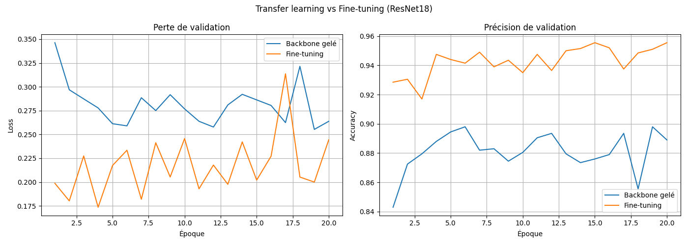
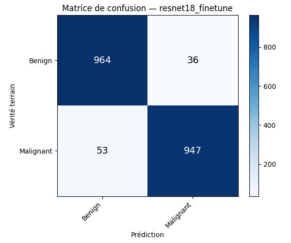

# Melanoma Classification with Deep Learning

Projet de classification d'images de lésions cutanées avec PyTorch. L'objectif est de comparer plusieurs approches de Deep Learning pour distinguer les images bénignes des mélanomes.

## Approches étudiées

- CNN entraîné from scratch
- normalisation des images
- data augmentation
- comparaison de plusieurs optimiseurs
- learning rate scheduler
- transfer learning avec ResNet18
- fine-tuning de ResNet18

## Résultat principal

Le meilleur résultat obtenu dans les expériences sauvegardées vient du fine-tuning de ResNet18.

- Accuracy : **95,55 %** sur 2 000 images
- Rappel de la classe mélanome : **94,70 %**
- 1 911 images correctement classées sur 2 000

Ces résultats correspondent à l'ensemble `melanoma-cancer-dataset/test`, utilisé comme ensemble d'évaluation dans les scripts du projet.





## Organisation

Les scripts permettent de tester progressivement les différentes stratégies d'entraînement. `train_resnet.py` compare un ResNet18 avec backbone gelé et un fine-tuning du dernier bloc. `analyze.py` charge le modèle entraîné et génère la matrice de confusion ainsi que le rapport de classification.

Le dataset est organisé dans :

```text
melanoma-cancer-dataset/
├── train/
└── test/
```

## Installation

```bash
pip install -r requirements.txt
```

Exemple pour lancer l'expérience ResNet18 :

```bash
python train_resnet.py
```

Puis pour analyser le modèle sauvegardé :

```bash
python analyze.py
```

## Technologies

Python, PyTorch, Torchvision, NumPy, Matplotlib, Pillow et scikit-learn.

> Projet académique de classification d'images. Les résultats obtenus ne constituent pas une validation pour un usage clinique.
